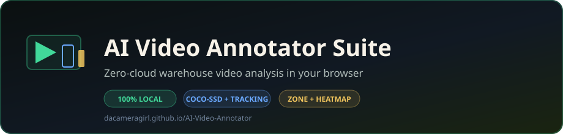

<p align="center">
  
</p>

<p align="center">
  <strong>Zero-cloud warehouse video analysis that runs entirely in your browser.</strong><br />
  Upload a clip and get live detection, tracking, virtual-fence zones, dwell times, heatmaps, and exportable reports. Your video never leaves your device.
</p>

<p align="center">
  <a href="https://dacameragirl.github.io/AI-Video-Annotator/"></a>
  <a href="https://github.com/DaCameraGirl/hydra-evaluator-app"></a>
</p>

<p align="center">
  
  
  
  
</p>

### Languages

<p align="center">
  
  
</p>

### Stack

<p align="center">
  
  
  
  
  
</p>

<p align="center">
  Built by <strong>Angela Hudson</strong> · <a href="https://github.com/DaCameraGirl">DaCameraGirl</a>
</p>

<p align="center"></p>
<p align="center"></p>


<p align="center"></p>
<p align="center"></p>


- **Live detection + tracking** — COCO-SSD (TensorFlow.js) runs on every frame; a lightweight IoU tracker gives each object a stable id, so you get unique counts, movement trails, and dwell times.
- **Your warehouse terminology** — generic detections are relabeled with approved terms (worker, forklift, pallet jack, tall metal shelving) drawn from the companion terminology config.
- **Virtual-fence zones** — draw Restricted / Safety / Loading / Walking / Storage zones right on the video. The Suite counts occupancy and logs entries; a worker entering a Restricted zone is flagged as an intrusion.
- **Activity heatmap** — see where objects spend the most time, to spot bottlenecks and busy lanes.
- **Caption QA (all in one)** — the warehouse caption checker is folded in: generate a caption from the current frame, then score it against approved terminology and present-tense rules.
- **Local projects** — save and reload zone layouts via IndexedDB. Nothing is uploaded.
- **Export** — download a human-readable report (`.txt`) and structured data (`.json`).

<p align="center"></p>
<p align="center"></p>


This tool does not fake detections.

- Object labels are **real COCO-SSD detections** relabeled with warehouse terms. COCO-SSD has 80 generic classes; where there is a sensible equivalent it is renamed (`person → worker`, `truck → forklift`), otherwise the original label is kept. Nothing is invented.
- **PPE (safety vests) is a clearly-tagged estimate.** COCO-SSD has no "vest" or "hard hat" class, so the Suite samples colors inside a worker's torso region and surfaces a vest as an *estimate* only. Estimates are always marked `(est.)` and are never counted as confirmed detections.
- Gendered guesses are intentionally **not** used (the terminology rules ban them); a detected person is a "worker".

<p align="center"></p>
<p align="center"></p>


<p align="center">
  
  
  
</p>

- React 19 + TypeScript + Vite
- Tailwind CSS v4
- TensorFlow.js (COCO-SSD, lite MobileNet-v2 backend)
- IndexedDB for local persistence
- GitHub Actions → GitHub Pages

No backend, no database, no API keys.

<p align="center"></p>
<p align="center"></p>


```bash
npm install
npm run dev
```

- Build: `npm run build` (output in `dist/`)
- Typecheck: `npm run typecheck`
- Lint: `npm run lint`

<p align="center"></p>
<p align="center"></p>


Pushing to `main` triggers `.github/workflows/deploy-pages.yml`, which builds the app and publishes `dist/` to GitHub Pages. The Vite `base` is set to `/AI-Video-Annotator/` for the project-page URL.

<p align="center"></p>
<p align="center"></p>


```
src/
  ml/            COCO-SSD loader + per-frame inference
  lib/           tracking, zones, heatmap, caption QA, export, IndexedDB, terms
  components/    VideoPlayer (stage), CanvasOverlay (draw), side panels
  App.tsx        app shell
```

<p align="center"></p>
<p align="center"></p>


This repo is **only** the warehouse video annotator. Project Hydra image A/B evaluation lives separately in [hydra-evaluator-app](https://github.com/DaCameraGirl/hydra-evaluator-app).

This Suite consolidates earlier warehouse tooling into one home:

- **Warehouse-Annotator** — original caption checker (folded in, archived)
- **Warehouse-Caption-Checker** — terminology QA rules (folded in, archived)

<p align="center"></p>
<p align="center"></p>


Copyright © 2026 Angela Hudson. All Rights Reserved. See [LICENSE](LICENSE). Viewing this repository does not grant a license to use the code.

<p align="center">
  <a href="https://dacameragirl.github.io/AI-Video-Annotator/"></a>
</p>